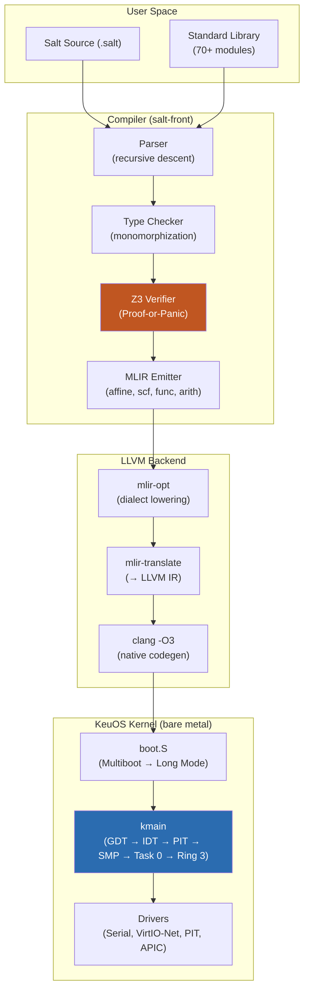
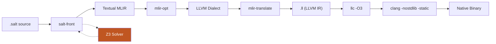
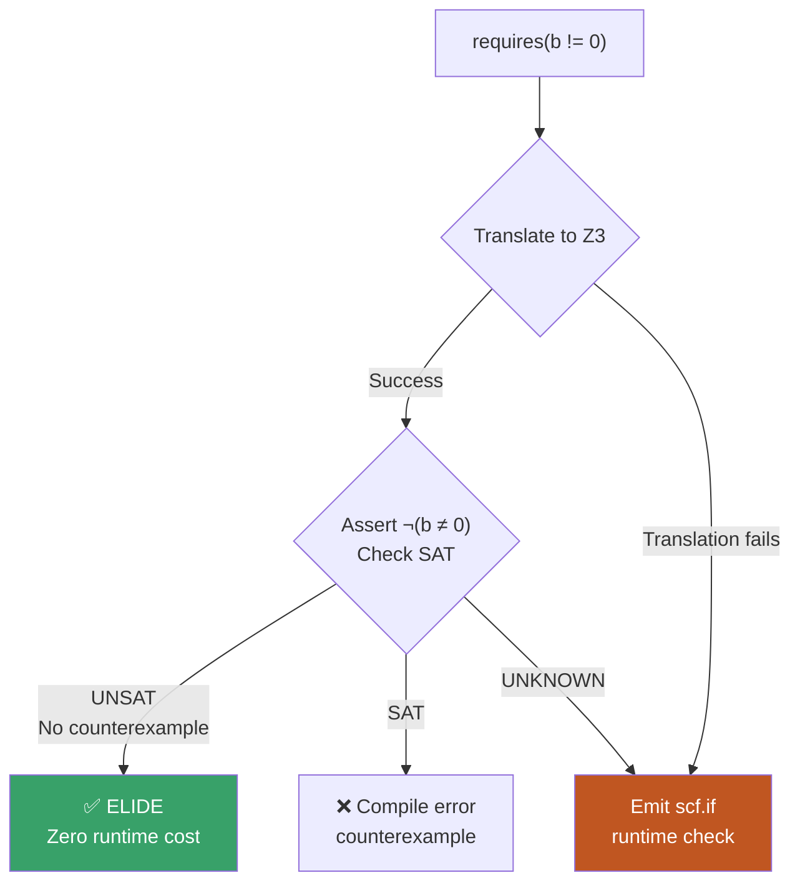
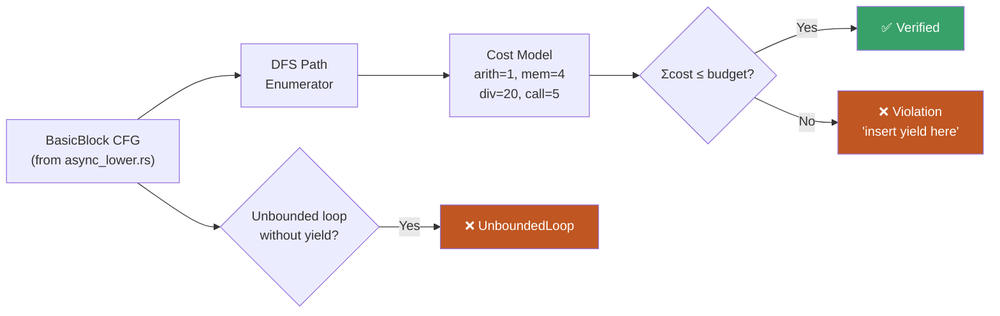
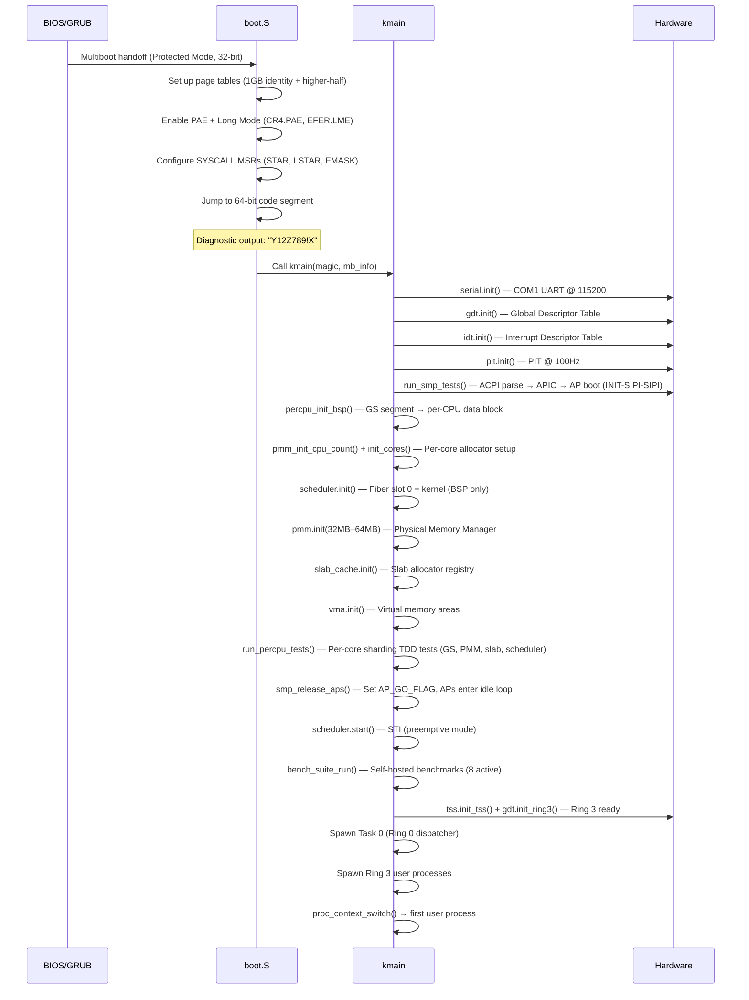
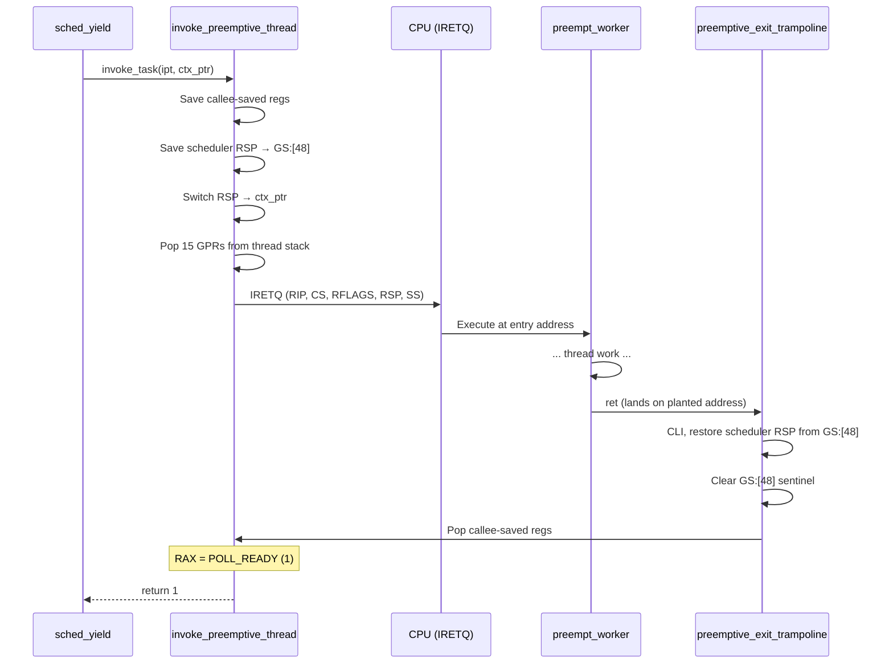
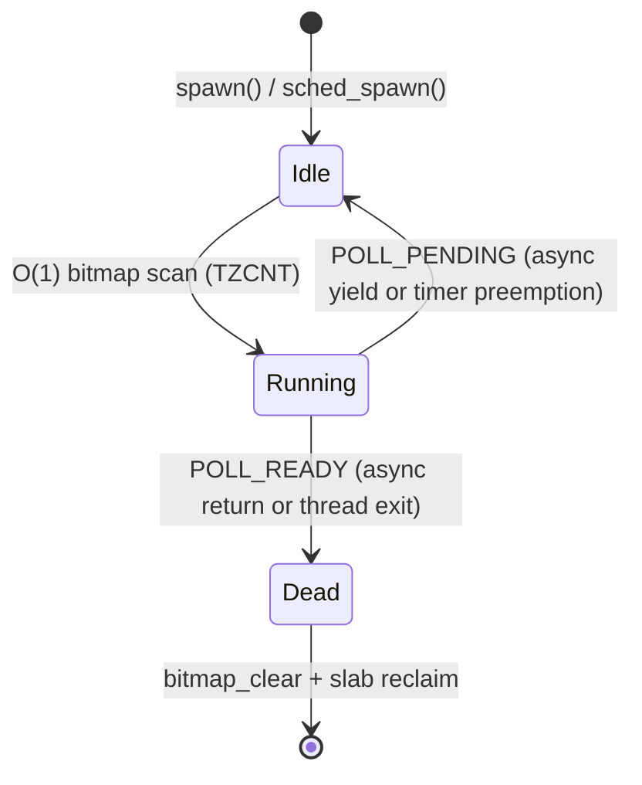
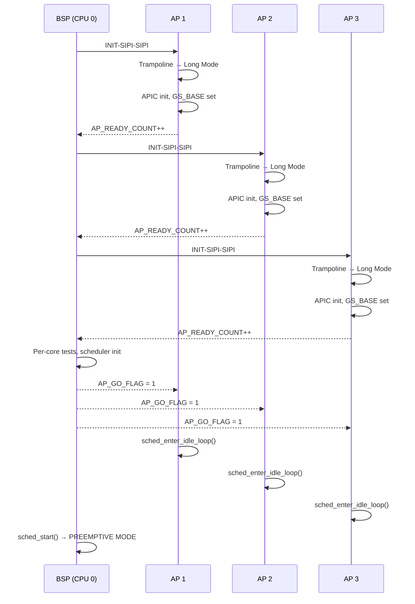
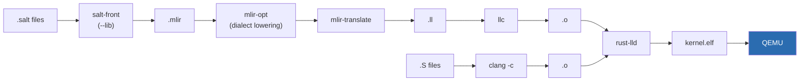

# KeuOS Architecture Reference

> **Audience**: Engineers working on the Salt compiler, KeuOS kernel, or standard library.
> For the 2 AM reader: every acronym is defined, every command is copy-pasteable, every data flow has a diagram.
>
> **Prerequisites**: Rust 1.75+, Z3 4.12+ (`brew install z3`), LLVM 21+ (`brew install llvm@21`), QEMU (`brew install qemu`)

---

## Table of Contents

1. [System Overview](#1-system-overview)
2. [The Salt Compiler Pipeline](#2-the-salt-compiler-pipeline)
3. [Z3 Proof-or-Panic: Formal Verification](#3-z3-proof-or-panic-formal-verification)
4. [The KeuOS Unikernel](#4-the-keuos-unikernel)
5. [Kernel Boot Sequence](#5-kernel-boot-sequence)
6. [Memory Architecture](#6-memory-architecture)
7. [Scheduler & Fibers](#7-scheduler--fibers)
8. [Drivers](#8-drivers)
9. [Build System](#9-build-system)
10. [Standard Library](#10-standard-library)
11. [Troubleshooting](#11-troubleshooting)

---

## 1. System Overview

KeuOS is a vertically integrated systems platform. The Salt language compiles to native code through MLIR/LLVM, and the KeuOS unikernel executes it on bare metal (or QEMU). Every layer, from syntax to syscall, is designed for formal verification.



| Layer | Language | Role |
|-------|----------|------|
| **salt-front** | Rust | Compiler: parse, typecheck, verify, emit MLIR |
| **salt (legacy)** | C++ | Dialect definitions (`SaltOps.td`). Z3 pass superseded. |
| **KeuOS kernel** | Salt + x86 Assembly | Unikernel: boot, scheduling, memory, drivers |
| **Standard library** | Salt | `String`, `Vec`, `HashMap`, `File`, `TcpListener`, `JSON`, `nn`, SIMD |
| **Runtime** | C | `runtime.c`: arena allocator, clock, threading, panic hooks |

---

## 2. The Salt Compiler Pipeline

Salt uses a **single Rust frontend** (`salt-front`) that handles everything from parsing to MLIR emission. The MLIR output uses **only standard MLIR dialects**; no custom ops leak to downstream tools.



### Pipeline Stages

| # | Stage | Tool | What It Does | Output |
|---|-------|------|--------------|--------|
| 1 | **Parse & Type Check** | `salt-front` | Recursive-descent parsing, monomorphization, trait resolution | Typed AST |
| 2 | **Z3 Verification** | `salt-front` (Z3 embedded) | Proves `requires`/`ensures` contracts. Proven → elide. Unproven → runtime check. | Proof results |
| 2.5 | **Async Lowering** | `salt-front` | `async fn` → state machine CFG. `@pulse` verifier asserts all paths yield within cycle budget. | `BasicBlock` CFG |
| 3 | **MLIR Emission** | `salt-front` | Emits textual MLIR using `affine`, `scf`, `func`, `arith`, `memref`, `llvm` dialects | `.mlir` file |
| 4 | **Dialect Lowering** | `mlir-opt` | `--lower-affine`, `--convert-linalg-to-loops`, `--convert-vector-to-scf`, `--convert-scf-to-cf`, `--convert-cf-to-llvm`, `--convert-vector-to-llvm`, `--convert-math-to-llvm`, `--convert-arith-to-llvm`, `--finalize-memref-to-llvm`, `--convert-func-to-llvm`, `--cse`, `--reconcile-unrealized-casts` | LLVM dialect MLIR |
| 5 | **LLVM IR Translation** | `mlir-translate` | `--mlir-to-llvmir` | `.ll` file |
| 6 | **Native Compilation** | `llc -O3` + `clang -nostdlib -static` | LLVM optimization + native codegen + link | ARM64/x86_64 binary |

### Multi-Dialect Emission

Salt's key compiler innovation is **body analysis**: the compiler inspects loop structure to choose the optimal MLIR dialect:

| Loop Pattern | Detection Signal | MLIR Dialect | Optimization |
|--------------|-----------------|--------------|-------------|
| Tensor indexing (`A[i,j]`) | Array subscript in loop body | `affine.for` | Polyhedral tiling, vectorization |
| Scalar accumulation | No array indexing | `scf.for` with `iter_args` | Register allocation, SSA reduction |
| SIMD operations | `@fma_update`, `vector_*` intrinsics | `vector` dialect | NEON/AVX mapping |

> This is why Salt achieves competitive performance on matmul — the `affine.for` dialect triggers MLIR's polyhedral optimizer, which tiles loops for cache hierarchy and vectorizes across NEON registers.

### Key Source Locations

| Component | Path | Purpose |
|-----------|------|---------|
| Parser | `salt-front/src/grammar/` | Custom recursive-descent parser |
| Codegen | `salt-front/src/codegen/` | MLIR emission (30+ modules) |
| Z3 Verification | `salt-front/src/codegen/verification/` | Contract proving, arena escape analysis |
| @pulse Verifier | `salt-front/src/hir/verify_pulse_bounds/` | DFS path-cost analysis for async CFGs |
| Async Lowering | `salt-front/src/hir/async_lower.rs` | CFG builder, state machine transformation |
| Async Codegen | `salt-front/src/codegen/passes/async_to_state.rs` | MLIR emission: TaskFrame, jump tables, spill/reload |
| Type System | `salt-front/src/types.rs` | Type representation and promotion |
| Runtime | `salt-front/runtime.c` | Arena allocator, panic hooks, threading |

---

## 3. Z3 Proof-or-Panic: Formal Verification

> [!IMPORTANT]
> **The defining feature of Salt.** Every `requires` contract has exactly **one of two outcomes**. There is no third path.



### How It Works

1. **Translate**: The compiler converts the `requires` expression to a Z3 boolean formula
2. **Negate**: Z3 asserts the **negation** of the condition (`¬(b ≠ 0)`)
3. **Solve**:
   - **UNSAT** → No counterexample exists → The condition is **always true** → Emit nothing. Zero overhead.
   - **SAT** → A counterexample exists → Compile-time error with counterexample values
   - **UNKNOWN** → Z3 timed out → Emit standard MLIR runtime assertion

### The Fallback: Standard MLIR

When Z3 cannot prove a contract, the compiler emits structured control flow that any MLIR tool understands:

```mlir
// 1. Invert the condition (true = violation)
%true_N = arith.constant true
%violated_N = arith.xori %cond, %true_N : i1

// 2. Structured assertion (safe inside affine.for / scf.for)
scf.if %violated_N {
    func.call @__salt_contract_violation() : () -> ()
    scf.yield
}
```

> [!WARNING]
> The fallback uses `scf.if` — **not** `cf.cond_br`. Using `cf.cond_br` with block labels inside structured regions (`affine.for`, `scf.for`) is **illegal in MLIR** and will crash `mlir-opt`. This is a well-known MLIR trap.

### Runtime Panic Handler

The `@__salt_contract_violation` function is defined in `salt-front/runtime.c`:

```c
void __salt_contract_violation() {
    fprintf(stderr, "FATAL: Salt contract violation (requires/ensures/invariant)\n");
    abort();
}
```

### Verification in Practice

```salt
// PMM: Zero-overhead verification in the kernel
pub fn init(start: u64, end: u64)
    requires(start < end)          // Z3 proves at every call site
{ ... }

pub fn alloc() -> u64
    ensures(result % PAGE_SIZE == 0 || result == 0)   // Post-condition
{ ... }
```

If the kernel calls `pmm.init(0x100000, 0x400000)`, Z3 proves `0x100000 < 0x400000` and the entire contract check is **erased from the binary**. The resulting MLIR contains only the function body — no guards, no branches, no overhead.

### @pulse: Cycle-Budget Verification for Async Functions

Async functions are compiled into stackless state machines. Without safeguards, a state machine that loops without yielding could starve other fibers on the same core. The `@pulse` verifier solves this at compile time.



**How it works:** After `build_cfg()` constructs the `BasicBlock` graph, the verifier DFS-enumerates all acyclic paths from entry to `Yield`/`Return`. Each path's cost is the sum of its statement costs. If any path exceeds the budget, the compiler rejects the function.

| Operation | Cost (cycles) |
|-----------|:---:|
| Arithmetic (add, sub, mul) | 1 |
| Comparison / branch | 1 |
| Memory load/store | 4 |
| Division / modulo | 20 |
| Function call | 5 |
| Unbounded loop (no yield) | ∞ |

---

## 4. The KeuOS Unikernel

KeuOS is a **hybrid unikernel** with Ring 0/3 isolation. The kernel runs in Ring 0, user processes run in Ring 3 with separate page tables. Safety is reinforced by the **compiler** (Z3 proofs) in addition to hardware protection mechanisms.

### Why This Matters

| Traditional OS | KeuOS |
|---------------|---------|
| Safety via MMU + Ring 0/3 isolation | Safety via Z3 compile-time proofs + hardware rings |
| Driver crashes kernel | Driver is compiler-verified |
| Runtime overhead for protection | Proven checks elided at compile time |

### Directory Structure

```
kernel/
├── arch/
│   ├── x86/              # 32-bit bootstrap, ISRs, SMP
│   │   ├── boot.S        # Multiboot header → Protected Mode → Long Mode → SYSCALL MSRs
│   │   ├── isr_wrapper.S # Interrupt Service Routine wrapper
│   │   ├── gdt.salt      # GDT setup + Ring 3 expansion
│   │   ├── tss.salt      # TSS setup for Ring 3
│   │   ├── acpi.salt     # ACPI RSDP/RSDT/MADT parser (CPU enumeration)
│   │   ├── apic.salt     # Local APIC + MMIO access
│   │   ├── smp.salt      # SMP controller: INIT-SIPI-SIPI AP bring-up + scheduler wiring
│   │   ├── smp_test.salt # TDD tests for SMP bring-up (5 layers)
│   │   ├── smp_helpers.S # GS_BASE MSR writes, atomic helpers
│   │   ├── linker.ld     # Linker script (AP trampoline section)
│   │   └── syscall_entry_fast.S  # SYSCALL/SYSRET fast path (SWAPGS, Ring 3 isolation)
│   └── x86_64/           # 64-bit runtime
│       ├── proc_switch.S     # Ring 0/3 context switch
│       ├── proc_helpers.S    # Address/trampoline helpers
│       ├── async_call.S      # invoke_task: 3-instruction indirect call (Universal Task Pointer)
│       ├── preempt_stub.S    # Preemptive ABI wrapper (IRETQ frame, exit trampoline, user_stack_init for Ring 3)
│       ├── rdtsc.S           # Cycle counter (benchmarking)
│       ├── syscall_noop.S    # Null syscall stub (benchmarking)
│       └── context_switch_asm.S  # Fiber context switch (GPR + FXSAVE)
├── benchmarks/           # Self-hosted kernel benchmarks
│   ├── suite.salt        # Benchmark harness + CPUID topology detection
│   ├── alloc_bench.salt  # Arena allocation 
│   ├── ctx_switch_bench.salt # Context switch scaling (4/16/64 fibers)
│   ├── ipc_bench.salt    # Fiber-to-fiber IPC 
│   ├── pmm_bench.salt    # Physical page alloc/free 
│   ├── smp_bench.salt    # Per-core PMM/slab throughput + AP boot verification
│   ├── irq_latency_bench.salt  # PIT interrupt delivery
│   ├── slab_stress_bench.salt  # Treiber stack CAS stress
│   ├── slab_reclaim_bench.salt # Ephemeral fiber slab reclaim
│   ├── netd_bench.salt         # NetD C10M: 19-gate data plane + TCP stack
│   └── socket_bench.salt       # Socket API: 8-gate TDD (136 cy/64B data plane)
├── boot/                 # Boot-time utilities
├── core/
│   ├── main.salt         # kmain() — kernel entry point
│   ├── scheduler.salt    # O(1) bitmap scheduler (per-core sharded, 256 fibers/core)
│   ├── syscall.salt      # Syscall dispatch (SYSCALL/SYSRET + INT 0x80)
│   ├── dispatcher.salt   # Task 0 immortal Ring 0 event loop
│   ├── pulse.salt        # SPSC ring buffer (ISR → dispatcher)
│   ├── process.salt      # Process table (16 slots)
│   ├── exec_user.salt    # ELF loader + Ring 3 process spawner
│   ├── pmm.salt          # Lock-free physical memory manager (per-core sharding)
│   ├── percpu.salt       # Per-CPU data structure (GS segment indexed)
│   ├── percpu_test.salt  # TDD tests for per-core sharding
│   ├── vma.salt          # Virtual memory area factory
│   ├── cpuid.salt        # CPUID detection (KVM vs TCG)
│   ├── timing.salt       # Cycle counter wrappers
│   ├── context.salt      # Fiber context structures
│   ├── context_switch.salt  # Fiber switch Salt-side logic
│   ├── async_test.salt   # TDD tests for async fiber dispatch (4 layers)
│   ├── preempt_test.salt # TDD tests for preemptive unification (6 layers)
│   ├── nm_fpu.salt       # FPU state save/restore (FXSAVE/FXRSTOR)
│   ├── elf_loader.salt   # Multiboot ELF section parser
│   ├── memory.salt       # Memory subsystem init + verification
│   ├── region.salt       # Region allocator
│   ├── ring3_test.salt   # Ring 3 TDD tests (IRETQ frame, KPTI CR3, end-to-end SYSCALL)
│   ├── keuos_reclaim.salt # KeuOS Reclamation: 5-phase hardware-fenced teardown
│   ├── reclaim_histogram.salt # P99 reclamation telemetry (1024-entry circular buffer)
│   └── panic.salt        # Kernel panic with serial diagnostics
├── drivers/
│   ├── serial.salt       # COM1 UART (115200 baud, 8N1)
│   ├── vga.salt          # VGA text mode (80×25)
│   ├── pit.salt          # PIT timer (100 Hz)
│   ├── virtio.salt       # VirtIO transport layer
│   └── virtio_net.salt   # VirtIO-Net driver
├── mem/
│   ├── slab_cache.salt   # Slab cache registry + factory
│   ├── slab.salt         # O(1) slab allocator (Treiber stack + CAS)
│   ├── page.salt         # Page-level operations
│   ├── page_sweep.salt   # Atomic Page Table Sweep: non-recursive PML4 teardown (4KB/2MB/1GB)
│   ├── user_paging.salt  # Per-process page tables
│   └── mm_layout.salt    # Memory map constants
├── user/
│   └── ring3_payload.S   # Minimal Ring 3 binary: syscall(60, 42)
├── net/
│   ├── eth.salt          # Ethernet frame parsing
│   ├── ip.salt           # IPv4 parsing + checksum
│   ├── udp.salt          # UDP datagram handling
│   ├── arp.salt          # ARP table
│   ├── netd_bridge.salt      # NetD RX: VirtIO → SPSC ring (len-prefixed)
│   ├── netd_tx_bridge.salt   # NetD TX: SPSC ring → VirtIO (symmetric)
│   ├── netd_parse.salt       # bswap16/32 + ARP header parse/build
│   ├── netd_arp.salt         # 256-entry static ARP cache, LRU eviction
│   ├── netd_tcp.salt         # 1024-entry static TCB pool (32KB)
│   └── netd_tcp_parse.salt   # TCP parse/build + RFC 793 checksum
├── lib/
│   ├── ipc_shm.salt          # SPSC ring buffer (producer/consumer)
│   ├── ipc_ring.salt         # SpscRing struct (@align(64)) + SpscDescriptor
│   └── ipc_arbiter.salt      # SipHash-2-4 proof-hint arbiter (O(1) validation)
├── sched/                # Scheduler support modules
user/
├── lib/
│   ├── socket_protocol.salt  # IPC command dictionary (CMD_BIND/ACCEPT/CLOSE)
│   ├── socket.salt           # Zero-trap socket API (control plane IPC + data plane SPSC)
│   └── syscall.salt          # Syscall bindings (ipc_send/recv, shm_grant)
├── netd.salt                 # NetD IPC dispatcher (binding table, FD allocator)
├── sip_app.salt              # SIP application
└── syscall_stubs.S           # Assembly syscall stubs
```

---

## 5. Kernel Boot Sequence



### Boot Stages (Detailed)

| # | Stage | Component | What Happens | Why |
|---|-------|-----------|-------------|-----|
| 1 | **Multiboot** | `boot.S` | GRUB loads kernel ELF, sets up 32-bit Protected Mode | Standard x86 boot protocol |
| 2 | **Page Tables** | `boot.S` | 1GB identity map (512 × 2MB pages) + higher-half at `0xFFFFFFFF80000000` | Kernel + BSS + PMM all within mapped range |
| 3 | **Long Mode** | `boot.S` | Enables PAE (CR4), Long Mode (EFER.LME), paging (CR0) | 64-bit mode required for full address space |
| 4 | **SYSCALL MSRs** | `boot.S` | Programs EFER.SCE, STAR, LSTAR → `syscall_entry_fast`, FMASK = 0x200 | SYSCALL/SYSRET fast path for Ring 3 |
| 5 | **Serial Init** | `serial.salt` | COM1 @ 115200 baud, 8N1, FIFO enabled | **First** — all diagnostics depend on serial |
| 6 | **GDT** | `gdt.salt` | 64-bit code/data segments (flat 4GB, D/B=1, G=1) | CPU needs valid segment descriptors |
| 7 | **IDT** | `idt.salt` | 256-entry interrupt vector table, ISR wrappers | Must be set up before enabling interrupts (STI) |
| 8 | **PIT** | `pit.salt` | Channel 0 at 100Hz (divisor = 11932) | Drives preemptive scheduling |
| 9 | **SMP Bring-up** | `smp.salt` | ACPI MADT parse → APIC enable → INIT-SIPI-SIPI for each AP (sequential, per-AP handshake) | Multi-core CPU enumeration and AP wake |
| 10 | **Per-CPU Init** | `percpu.salt` | BSP GS segment → `PerCpuData` block; per-core PMM/slab setup | `get_cpu_id()` via `mov rax, gs:[0]` |
| 11 | **Scheduler** | `scheduler.salt` | Marks fiber slot 0 (kernel) as active on BSP | Scheduler must exist before spawning fibers |
| 12 | **PMM** | `pmm.salt` | Initializes Treiber stack over 32MB–64MB physical range | Dynamic memory for slab, VMA, user pages |
| 13 | **Slab Cache** | `slab_cache.salt` | Registry + factory for typed object caches | O(1) allocation for kernel structures |
| 14 | **VMA** | `vma.salt` | Virtual memory area cache (32-byte objects) | `sys_brk` / `sys_mmap` support |
| 15 | **Per-Core Tests** | `percpu_test.salt` | TDD assertions: BSP GS, PMM, slab, scheduler, zero contention | Validates GS-indexed per-CPU data paths |
| 15.5 | **Async Fiber Tests** | `async_test.salt` | TDD assertions: Poll ABI, spawn_async slot, immediate completion, multi-step coroutine | Validates async dispatch via `invoke_task` |
| 15.75 | **Preemptive Unification Tests** | `preempt_test.salt` | 6-layer bottom-up TDD: symbol resolve, IRETQ frame validation, direct dispatch, invoke_task wrapper, spawn+yield integration | Validates the Universal Task Pointer end-to-end |
| 16 | **AP Release** | `smp_release_aps()` | Sets `AP_GO_FLAG`; each AP calls `sched_enter_idle_loop()` (init per-core state + STI + HLT) | APs join scheduling matrix |
| 17 | **STI** | `scheduler.start()` | Enables interrupts on BSP → preemptive scheduling begins | PIT drives timeslicing |
| 17.5 | **Kernel CR3** | `percpu_set_kernel_cr3()` | Saves kernel PML4 to `PerCpuData.kernel_cr3` (GS:[64]) for KPTI CR3 swap | Must be before benchmarks (Arrow of Time) |
| 18 | **Benchmarks** | `bench_suite_run()` | Ring 3 TDD gates (IRETQ frame, KPTI CR3, SYSCALL e2e) + self-hosted kernel benchmarks | Clean measurements before user processes |
| 19 | **Ring 3** | `tss.init_tss()` + `gdt.init_ring3()` | TSS with RSP0, Ring 3 GDT entries (User CS=0x2B, DS=0x23) | Hardware protection for user processes |
| 20 | **Process Spawn** | `exec_user.spawn_process()` | Task 0 dispatcher + Ring 3 user processes with per-process page tables | Full userspace isolation |

> [!CAUTION]
> **Order matters.** The IDT _must_ be initialized before `scheduler.start()` calls `STI`. If interrupts fire before the IDT is set up, the CPU triple-faults and QEMU resets.

---

## 6. Memory Architecture

### Physical Memory Manager (PMM)

The PMM uses a **lock-free Treiber stack** — a classic concurrent data structure where each free page contains a pointer to the next free page.


**Allocation** (`pmm.alloc()`): Atomically pops the head via `cmpxchg`:
```salt
let (old_head, success) = cmpxchg(&FREE_LIST_HEAD, head, next_node);
```

**Deallocation** (`pmm.free(addr)`): Links the page to current head, atomically swaps:
```salt
*(addr as &mut FreePageNode) = FreePageNode(head);
let (_, success) = cmpxchg(&FREE_LIST_HEAD, head, addr as !llvm.ptr);
```

**Z3 Verification**: `pmm.init(start, end)` has `requires(start < end)` — Z3 proves this at every call site.

### Slab Allocator (Fiber Stacks)

The slab allocator uses a **per-core sharded Treiber stack** for O(1) allocation and deallocation with zero cross-core contention. Each core owns a `SlabCoreState` struct, cacheline-padded to 64 bytes to prevent false sharing:

```salt
@atomic @packed
struct SlabCoreState {
    head_ptr: u64,      // Treiber stack head (16-byte aligned for cmpxchg16b)
    head_gen: u64,      // ABA generation counter
    fresh_count: i32,   // Bump allocator watermark
    core_offset: i32,   // This core's slot partition offset
    // ... padding to 64 bytes
}
```

Allocation uses **128-bit hardware CAS** (`cmpxchg16b`) with a generation counter to eliminate the ABA problem:

```salt
let (old_ptr, old_gen, success) = atomic_cas_128(
    head_addr,
    current_ptr, current_gen,    // Expected
    next_ptr, current_gen + 1    // Desired
);
```

When the free stack is empty, the allocator falls back to a per-core bump allocator within the core's partition of the slab region.

### Userspace Memory (runtime.c)

For userspace Salt programs, `runtime.c` provides:

| Allocator | Strategy | Use Case |
|-----------|----------|----------|
| **Arena** | 256MB mmap'd region, bump pointer, `mark()`/`reset_to()` | Hot paths, benchmarks, f-strings |
| **HeapAllocator** | `posix_memalign` + `free` | Long-lived objects (`Vec`, `String` backing storage) |
| **System** | `salt_sys_alloc` / `salt_sys_dealloc` | Explicit aligned allocation |

---

## 7. Scheduler & Fibers

KeuOS uses an **O(1) multi-level bitmap scheduler**, per-core sharded across all online CPUs. Each core owns an independent `SchedulerState` with 256 fiber slots, indexed by `cpu_id` via GS segment. This eliminates all cross-core contention on spawn/yield/exit paths.

### The Universal Task Pointer

The scheduler is **type-blind**. Every fiber, whether it is a cooperative async state machine or a hardware-preempted thread, is dispatched through a single 3-instruction assembly primitive:

```asm
invoke_task:
    mov  rax, rdi      // rax = step_fn
    mov  rdi, rsi      // rdi = ctx
    call rax            // call step_fn(ctx) → returns i64
    ret
```

The return value is a **Poll ABI** discriminant:

| Value | Meaning | Scheduler Action |
|:-----:|---------|------------------|
| `0` | `POLL_PENDING` | Fiber is suspended. Keep in bitmap. |
| `1` | `POLL_READY` | Fiber is complete. Reclaim resources. |

There is no branch on fiber type. No virtual function table. No tag-match. The scheduler calls `invoke_task(step_fn, ctx)` and acts on the integer it gets back.

### ZST Context Erasure

The `ctx` pointer passed to `invoke_task` is determined at spawn time with zero runtime branching:

| Fiber Type | `step_fn` | `ctx` Source | What `ctx` Points To |
|------------|-----------|-------------|---------------------|
| **Async** (cooperative) | Compiler-emitted state machine | `task_frame` (slab-allocated TaskFrame) | Resume state index, spilled locals, coroutine payload |
| **Preemptive** (hardware) | `invoke_preemptive_thread` (assembly) | `stack_ptr` (IRETQ frame + saved GPRs) | 15 zeroed GPRs + 5-word IRETQ frame (RIP, CS, RFLAGS, RSP, SS) |

The scheduler selects `ctx` with a single conditional:

```salt
let mut ctx = fibers[next].task_frame;   // Non-zero for async
if ctx == 0 {
    ctx = fibers[next].stack_ptr;        // Fallback for preemptive
}
let status = invoke_task(step_fn, ctx);  // Type-blind dispatch
```

The fiber type is erased into the function pointer. `invoke_preemptive_thread` knows how to interpret `ctx` as a saved hardware context; the async step function knows how to interpret `ctx` as a TaskFrame. The scheduler knows neither.

### Preemptive ABI Wrapper

`invoke_preemptive_thread` makes a hardware thread look like a function call. It resides in `preempt_stub.S` and has four cooperating routines:



**Timer preemption** follows a parallel path. When the APIC timer fires during a preemptive fiber:

1. The ISR checks `GS:[48]` (non-zero = preemptive fiber running)
2. `preempt_return_to_scheduler` saves 15 GPRs on the thread stack, records the thread's RSP in `GS:[56]`
3. Restores the scheduler RSP from `GS:[48]`, clears the sentinel, sends EOI
4. Returns `POLL_PENDING (0)` to the scheduler as if the function returned cooperatively

The scheduler updates `fibers[next].stack_ptr` from `GS:[56]` and keeps the fiber in the bitmap. On the next dispatch, `invoke_preemptive_thread` resumes exactly where the timer interrupted.

### The Z3 `@pulse` Verifier

Async fibers are compiled into stackless state machines. Without safeguards, a state machine that loops without yielding could starve other fibers on the same core. The `@pulse` verifier catches this at compile time.

After `build_cfg()` constructs the `BasicBlock` graph, the verifier DFS-enumerates all acyclic paths from entry to `Yield`/`Return`. Each path's cost is the sum of its statement costs. If any path exceeds the budget, the compiler rejects the function.

| Operation | Cost (cycles) |
|-----------|:---:|
| Arithmetic (add, sub, mul) | 1 |
| Comparison / branch | 1 |
| Memory load/store | 4 |
| Division / modulo | 20 |
| Function call | 5 |
| Unbounded loop (no yield) | ∞ |

Preemptive fibers do not need `@pulse` verification. The APIC timer enforces yield boundaries in hardware.

> [!TIP]
> Async fibers are yield-verified by the compiler (Z3 `@pulse`), preemptive fibers are yield-enforced by hardware (APIC timer), and the scheduler cannot distinguish between the two. Cooperative speed with preemptive safety.

### State Machine



### Per-Core Architecture

Each CPU core gets its own `SCHED_ARRAY[cpu_id]` containing:
- **256 fiber slots** with O(1) free-slot lookup via inverted 2-level bitmap
- **L1 summary bitmap** (1 bit per group of 64 fibers)
- **L2 detail bitmaps** (1 bit per fiber within each group)
- **Per-CPU data** via GS segment: `sched_rsp` (offset 48), `saved_thread_rsp` (offset 56), `kernel_cr3` (offset 64)

### SMP AP Boot → Scheduler Integration



Each AP enters `enter_idle_loop()`, which initializes its per-core `SchedulerState`, enables interrupts, and enters a HLT loop. Timer IRQs wake APs; `spawn()` calls on any core schedule work via the local bitmap.

### Z3 Verification on `spawn_async`

```salt
pub fn spawn_async(step_fn_addr: u64, frame_size: u64) -> u64
    requires(step_fn_addr != 0)
    requires(frame_size > 0)
```
Z3 proves at every call site that no null function pointer or zero-byte frame can be spawned.

### Performance (KVM — Intel Xeon)

KeuOS uses highly optimized, lock-free, per-core sharded data structures. Actual cycle counts will vary significantly by hardware and KVM configuration, but the architecture uses lock-free, per-core sharded data structures on critical paths such as IPC, context switching, and memory allocation.

---

## 8. Drivers

All drivers are Salt modules that use port I/O (`io.outb` / `io.inb`) via inline assembly FFI.

### Serial (COM1 UART)

| Parameter | Value |
|-----------|-------|
| Base port | `0x3F8` (COM1) |
| Baud rate | 115,200 |
| Format | 8 data bits, no parity, 1 stop bit (8N1) |
| FIFO | Enabled, 14-byte threshold |

**Usage**: `serial.print("message")` — iterates bytes, polls TX empty status, writes to data port.

### VGA Text Mode

| Parameter | Value |
|-----------|-------|
| Buffer address | `0xB8000` (identity-mapped) |
| Resolution | 80 columns × 25 rows |
| Character format | 2 bytes: `[ASCII byte, attribute byte]` |

### PIT (Programmable Interval Timer)

| Parameter | Value |
|-----------|-------|
| Frequency | 100Hz |
| Command port | `0x43` |
| Data port | `0x40` (Channel 0) |
| Mode | Square wave generator (Mode 2) |
| Divisor | 11,932 (1,193,182 Hz / 100) |

The PIT fires IRQ 0, which triggers the ISR wrapper. The ISR first checks the `GS:[48]` sentinel: if non-zero, a preemptive fiber is running and the ISR saves its state via `preempt_return_to_scheduler`. Otherwise, the legacy path sets `yield_pending = true` for cooperative scheduling.

---

## 9. Build System

### Userspace Salt Programs

```bash
# Build the compiler (one-time)
cd salt-front
Z3_SYS_Z3_HEADER=/opt/homebrew/include/z3.h \
LIBRARY_PATH=/opt/homebrew/lib \
cargo build --release

# Compile a Salt program to native binary
export PATH="/opt/homebrew/opt/llvm@21/bin:$PATH"
export DYLD_LIBRARY_PATH="/opt/homebrew/lib"

./target/release/salt-front ../examples/hello_world.salt
# Produces: hello_world binary in current directory
```

### KeuOS Kernel

```bash
# One-command build + boot
./scripts/demo_keuos.sh

# Or step-by-step:
python3 tools/runner_qemu.py build   # Compile kernel → kernel.elf
python3 tools/runner_qemu.py run     # Build + boot in QEMU
```

### Kernel Compilation Pipeline



### Benchmarks

```bash
# Run all Salt benchmarks (28 benchmarks vs C and Rust)
cd benchmarks && ./benchmark.sh -a

# Run specific benchmarks
./benchmark.sh matmul forest lru_cache

# Run compilation time benchmarks
cd benchmarks && ./compile_time_bench.sh

# Run KeuOS Train (MNIST neural network)
cd benchmarks/ml && ./benchmark.sh --salt
```

---

## 10. Standard Library

70+ modules across 20+ packages. Location: `salt-front/std/`

| Package | Key Modules | Highlights |
|---------|-------------|------------|
| `std.string` | `String` | Heap-backed, UTF-8, `+` concat, f-string support |
| `std.collections` | `Vec<T,A>`, `HashMap<K,V>`, `HashSet<K>` | Swiss-table hashing, generic allocator |
| `std.io` | `File`, `BufferedWriter`, `println!` | Zero-copy reads, 8KB write buffering |
| `std.net` | `TcpListener`, `TcpStream` | kqueue-based event loop, 359K req/s HTTP |
| `std.time` | `Instant`, `Duration` | Nanosecond monotonic clock (`mach_absolute_time` / `clock_gettime`) |
| `std.json` | `parse`, `stringify` | Streaming parser, arena-allocated AST |
| `std.nn` | `matmul`, `relu`, `softmax`, `fma_update` | MLIR affine tiling, NEON FMLA intrinsics |
| `std.thread` | `spawn`, `join` | pthread-based, 1:1 threading |
| `std.sync` | `Mutex`, `Atomic<T>` | pthread mutex, C11 atomics |
| `std.mem` | `Arena`, `HeapAllocator`, `Alloc` | Region-based allocation with move semantics |

---

## 11. Troubleshooting

### Compiler Won't Build

| Symptom | Cause | Fix |
|---------|-------|-----|
| `ld: library not found for -lz3` | Z3 not installed or not on library path | `brew install z3` then `export LIBRARY_PATH=/opt/homebrew/lib` |
| `z3.h not found` | Z3 header path not set | `export Z3_SYS_Z3_HEADER=/opt/homebrew/include/z3.h` |
| `mlir-opt: command not found` | LLVM 21 not on PATH | `export PATH="/opt/homebrew/opt/llvm@21/bin:$PATH"` |

### Runtime Issues

| Symptom | Cause | Fix |
|---------|-------|-----|
| `FATAL: Salt contract violation` | A `requires` or loop invariant failed at runtime | Check the calling code — Z3 could not prove the contract at compile time, and the runtime condition is false |
| `Segmentation fault` during benchmark | Missing `DYLD_LIBRARY_PATH` for Z3 | `export DYLD_LIBRARY_PATH="/opt/homebrew/lib"` |

### Kernel Issues

| Symptom | Cause | Fix |
|---------|-------|-----|
| QEMU resets immediately | Triple fault — IDT not initialized before STI | Check boot order in `main.salt`: IDT must init before `scheduler.start()` |
| No serial output | Serial not initialized or wrong port | Verify `serial.init()` is first call in `kmain()` |
| `Y12Z789!X` but nothing else | Kernel panics after boot.S handoff | Run QEMU with `-d int` to see interrupt trace |

---

*KeuOS: compiler-verified, bare-metal systems programming.*
