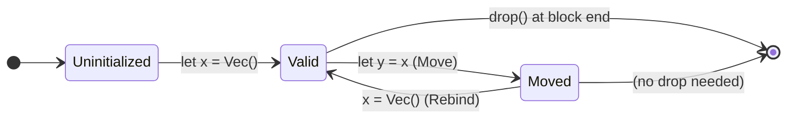

# Salt Move Semantics

## Overview

Salt uses **move semantics by default** — when a value is assigned to a new binding or passed to a function, the original binding is consumed. Using a consumed binding is a **compile-time error**.

> [!IMPORTANT]
> Salt's ownership model is simpler than Rust's: no lifetimes, no borrow checker. Values are either moved or copied. The compiler tracks which variables have been consumed and rejects use-after-move at compile time.



## How It Works

### Basic Move

```salt
let x = Vec::new();
let y = x;           // x is moved into y
println(x.len());    // ← COMPILE ERROR: "Use of moved value: x"
```

### Explicit Move

The `move` keyword explicitly consumes a variable:

```salt
let data = load_data();
move data;              // Explicitly consume data
process(data);          // ← COMPILE ERROR: "Use of moved value: data"
```

### Function Arguments

Passing a value to a function moves it:

```salt
fn consume(v: Vec<i32>) { /* v is owned here */ }

let items = Vec::new();
consume(items);          // items is moved into consume
items.push(42);          // ← COMPILE ERROR: "Use of moved value: items"
```

### Rebinding After Move

You can rebind a variable after it has been moved:

```salt
let mut x = Vec::new();
let y = x;              // x is moved
x = Vec::new();         // x is rebound — this is fine
x.push(42);             // OK — x is a fresh value
```

## Branch Tracking

The compiler uses **union tracking** across if/else branches. If a variable is moved in _any_ branch, it is considered moved after the if/else:

```salt
let data = load();
if condition {
    consume(data);       // moved in then-branch
} else {
    // data is NOT moved here
}
// After if/else: data is considered "potentially moved"
// Using it here may produce an error
```

## Implementation

Move tracking is implemented in the Salt compiler via:

- **`consumed_vars`**: A `HashSet<String>` in the `ControlFlowState` that tracks which variables have been consumed
- **`consumption_locs`**: A `HashMap<String, String>` recording where each move occurred (for error messages)
- **Branch merge**: After if/else, the compiler takes the union of consumed sets from both branches
- **Detection**: When a variable is referenced in `emit_path`, the compiler checks `consumed_vars` and emits `"Use of moved value: {name}"` if found

## Comparison with Rust

| Feature | Salt | Rust |
|---------|------|------|
| Move by default | ✅ | ✅ |
| Copy trait | Primitives auto-copy | Explicit `Copy` derive |
| Borrowing | `&T` references (no lifetime tracking) | `&T`, `&mut T` with lifetime analysis |
| Use-after-move | Compile error | Compile error |
| Complexity | Simple — no lifetimes | Complex — full borrow checker |
