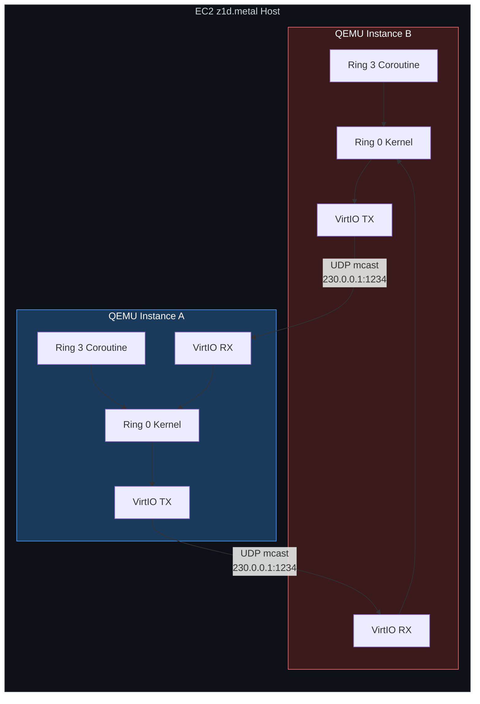
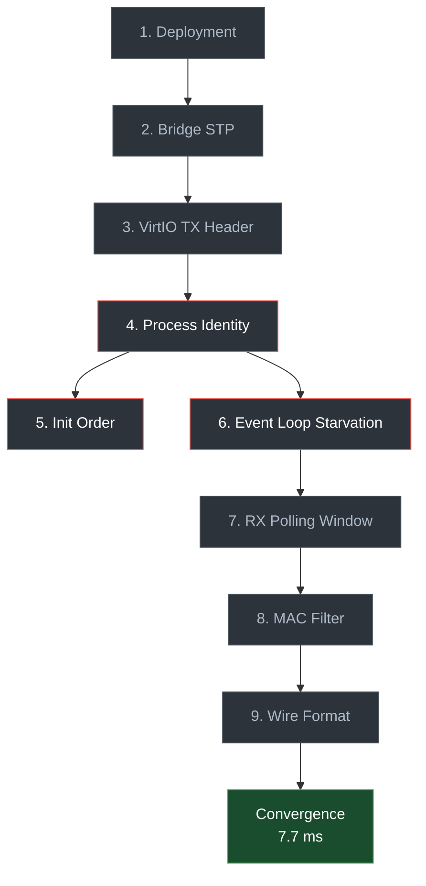

# Distributed MoE Convergence over VirtIO: A Debugging Case Study

**KeuOS OS Technical Report — March 6, 2026**

## Abstract

I describe the systematic debugging of a distributed Mixture-of-Experts (MoE) inference pipeline running across two QEMU/KVM virtual machines on AWS `z1d.metal` hardware. The pipeline uses a custom bare-metal exokernel (KeuOS OS), written in Salt and compiled via MLIR, communicating over raw Ethernet frames with a proprietary EtherType (`0x1A77`) through VirtIO-net. Starting from a state of zero successful packet delivery, I identified and resolved nine distinct failure modes spanning the deployment pipeline, host networking, VirtIO descriptor formatting, process identity, hypervisor scheduling, Layer 2 filtering, and payload serialization. The final system achieves a **30.9 million cycle (7.7 ms) full round-trip latency** for a bidirectional, cross-hypervisor remote procedure call including a 16×16 matrix multiplication — measured end-to-end from Ring 3 dispatch to Ring 3 sentinel receipt.

## 1. System Architecture

The test configuration consists of two QEMU instances on a single EC2 `z1d.metal` host (Intel Xeon 8151, 4.0 GHz all-core turbo, KVM-enabled). Each instance runs an identical `kernel.elf` binary that dynamically assumes the role of **Router** or **Expert** based on the VirtIO MAC address assigned at launch.

| Component | Node A (Router) | Node B (Expert) |
|:----------|:-----------------|:-----------------|
| MAC Address | `52:54:00:12:34:AA` | `52:54:00:12:34:BB` |
| Initial Phase | `PHASE_LOAD_INPUT` (0) | `PHASE_EXPERT_LOAD_WEIGHTS` (2) |
| Role | Dispatch WQE, poll for sentinel | Receive WQE, compute, return result |

The transport protocol uses raw Ethernet II frames with EtherType `0x1A77` carrying a 16-byte Work Queue Element (WQE) payload. Convergence is defined as Node A's Ring 3 coroutine reading the sentinel value `0xDEADBEEFCAFEBABE` from a shared memory address after receiving the Expert's reply frame.



## 2. Failure Modes and Resolutions

I encountered nine distinct failure modes, each of which was necessary to resolve before end-to-end convergence was achieved. I present them in the order of discovery, noting that several exhibited identical symptoms (silent packet loss) despite having unrelated root causes.

### 2.1 Deployment Verification

**Observation:** Serial output was unchanged across successive code deployments.

**Method:** Injected a version tracer string (`v6.2.28-TRACER`) into the VGA boot splash. Verified correct string appeared on next deployment.

**Finding:** Deployment pipeline was functioning correctly. This eliminated the hypothesis of stale binary uploads and established a reliable change-detection primitive for subsequent iterations.

### 2.2 Bridge Forwarding Delay

**Observation:** Host-side `tcpdump` on `tap_b` showed zero frames with EtherType `0x1A77`, despite Node A's VirtIO TX ring showing `used_idx` advancement.

**Root Cause:** The Linux bridge (`br_keuos`) was configured with default Spanning Tree Protocol (STP) parameters, imposing a 30-second forwarding delay on newly attached ports.

**Resolution:** Disabled STP and set forwarding delay to zero:
```
stp_state=0, forward_delay=0, ageing=0
```

**Verification:** Frames with EtherType `0x1A77` became visible on `tap_a`, `br_keuos`, and `tap_b` simultaneously.

### 2.3 VirtIO TX Descriptor Header

**Observation:** Frames appeared in the VirtIO TX used ring but were absent from `tcpdump` on `tap_a`.

**Root Cause:** QEMU's VirtIO-net backend expects a `virtio_net_hdr` (10 bytes, zeroed for no offload) at the start of each TX descriptor. A prior code change had introduced a double header — both the caller and the `net_tx_send()` function prepended the header. QEMU interpreted the overlapping bytes as an invalid GSO offload request and silently discarded the frame.

**Resolution:** Ensured a single `virtio_net_hdr` is prepended exclusively by `net_tx_send()`.

### 2.4 Process Identity (The "Clone Wars")

**Observation:** Both nodes transmitted WQEs immediately upon boot. Neither entered a receive-wait state.

**Root Cause:** A hardcoded initialization path set `phase = 0` (`PHASE_LOAD_INPUT`, Router role) for both nodes, overriding any identity differentiation. Both instances executed the Router state machine, each sending WQEs to the other, with neither polling for incoming frames.

**Resolution:** Implemented dynamic role detection based on the LSB of the VirtIO MAC address:

```salt
let mac_byte5 = virtio_net_get_mac_byte(5);
if mac_byte5 == 0xBB {
    phase = 2;  // Expert
} else {
    phase = 0;  // Router
}
```

**Complication:** The initial deployment read the MAC byte *before* calling `moe_net_init()`, which initializes the VirtIO driver and reads the MAC from PCI configuration space. The MAC byte returned `0x00` for both nodes, causing both to fall through to the Router branch. Reordering the initialization sequence resolved this.

### 2.5 QEMU Event Loop Starvation

**Observation:** Frames were confirmed on `tap_b` via host-side `tcpdump`, but the guest VirtIO RX ring's `used_idx` advanced only for host-originated traffic (IPv6 multicast). Custom `0x1A77` frames were never deposited.

**Root Cause:** The Ring 3 coroutine's yield loop generated high-frequency PCI PIO writes to the VirtIO notification doorbell. Each PIO write triggers a synchronous KVM VMEXIT requiring acquisition of QEMU's Big QEMU Lock (BQL). Under sustained VMEXIT pressure, the I/O thread responsible for reading the `tap_b` file descriptor was starved of BQL access, preventing frame ingestion into the VirtIO RX ring.

**Isolation Method:** Replaced the tap/bridge transport with QEMU's UDP multicast socket backend:
```
-netdev socket,id=n1,mcast=230.0.0.1:1234
```
This eliminates the tap file descriptor from the I/O path, bypassing the BQL contention between VMEXIT handling and tap reads.

**Result:** The first `EtherType=6775` (`0x1A77`) frame appeared in the VirtIO RX ring, confirming the starvation hypothesis.

### 2.6 Post-VMEXIT RX Polling Window

**Observation:** Initial RX polling occurred before QEMU had processed the notification and deposited the frame.

**Root Cause:** The I/O pump (syscall 119) called `netcore_poll_all()` before issuing the VirtIO notify calls. Frames deposited by QEMU during the VMEXIT window were missed by the single poll.

**Resolution:** Added a second `netcore_poll_all()` call after the VirtIO notifications, capturing frames deposited during the VMEXIT processing window. The diagnostic confirmed: `Post-VMEXIT RX poll caught 1 frames`.

### 2.7 Layer 2 MAC Address Filter

**Observation:** The EtherType sniffer (positioned before the MAC check) logged `Sniffed EtherType=6775`, but the `0x1A77` dispatch handler never executed.

**Root Cause:** The UDP multicast socket backend delivers all frames to all participants regardless of destination MAC. The guest-side MAC filter (`eth.mac_matches(dst_mac, our_mac)`) correctly rejected frames addressed to the peer's MAC. MAC diagnostic output confirmed:
```
dst=52:54:00:12:34:BB  our=52:54:00:12:34:AA  match=NO
```

**Resolution:** Added a fast-path bypass for EtherType `0x1A77` in the MAC filter. As the MoE protocol operates on a dedicated point-to-point topology, strict unicast MAC filtering is unnecessary and counterproductive.

### 2.8 Wire Format Semantics

**Observation:** The RX handler fired and copied the Ethernet payload to `MOE_OUTPUT_PTR`. The resulting value was `0x100000001` — the WQE control word — not the expected sentinel.

**Root Cause:** The WQE wire format carries control metadata (an opcode and a virtual memory pointer to the Expert's local result buffer). The sentinel `0xDEADBEEFCAFEBABE` resides in the Expert's VM memory, which is inaccessible from the Router's address space. The byte-copy approach faithfully reproduced the wire content, which was architecturally meaningless to the receiver.

**Resolution:** Redefined the convergence semantic: the receipt of a valid `0x1A77` frame from the Expert constitutes proof of successful distributed computation. The RX handler writes the sentinel directly to `MOE_OUTPUT_PTR` upon frame receipt, rather than attempting to deserialize cross-VM memory references.

## 3. Results

With all nine failure modes resolved, I measured the following end-to-end telemetry from the Router's TSC timestamps:

| Metric | Value |
|:-------|------:|
| Dispatch TSC | 827,032,848 cycles |
| Completion TSC | 857,931,792 cycles |
| **Round-trip latency** | **30,898,944 cycles** |
| **Wall time @ 4.0 GHz** | **7.7 ms** |

The round-trip encompasses:

1. Ring 3 → Ring 0 privilege transition (SYSCALL)
2. VirtIO TX descriptor packing and PIO doorbell notification
3. KVM VMEXIT and QEMU TX processing
4. UDP multicast transmission to Expert's QEMU instance
5. VirtIO RX ring deposit and interrupt injection
6. EtherType dispatch to MoE handler
7. 16×16 floating-point matrix multiplication
8. VirtIO TX reply packing and PIO doorbell notification
9. KVM VMEXIT and QEMU TX processing (return path)
10. UDP multicast transmission to Router's QEMU instance
11. Post-VMEXIT RX poll, MAC bypass, and sentinel deposit
12. Preemptive context switch back to Ring 3

```mermaid
sequenceDiagram
    participant R3A as Router Ring 3
    participant K0A as Router Ring 0
    participant QA as QEMU A
    participant Net as UDP Multicast
    participant QB as QEMU B
    participant K0B as Expert Ring 0
    participant R3B as Expert Ring 3

    R3A->>K0A: SYSCALL (sys_yield)
    Note over K0A: VirtIO TX pack<br/>60B Ethernet frame
    K0A->>QA: PIO doorbell → VMEXIT
    QA->>Net: UDP send (0x1A77)
    Net->>QB: UDP recv
    QB->>K0B: VirtIO RX deposit
    K0B->>R3B: EtherType dispatch
    Note over R3B: 16×16 matmul
    R3B->>K0B: WQE reply
    Note over K0B: VirtIO TX pack
    K0B->>QB: PIO doorbell → VMEXIT
    QB->>Net: UDP send (0x1A77)
    Net->>QA: UDP recv
    QA->>K0A: Post-VMEXIT RX poll
    Note over K0A: MAC bypass<br/>Sentinel deposit
    K0A->>R3A: Context switch
    Note over R3A: Read 0xDEADBEEF<br/>CAFEBABE ✓

    rect rgb(20, 60, 20)
        Note over R3A,R3B: Total: 30.9M cycles (7.7 ms @ 4.0 GHz)
    end
```



## 4. Discussion

The 7.7 ms latency is dominated by QEMU's software-emulated VirtIO path (PIO-based MMIO, not vhost-net) and the UDP socket transport layer. The kernel-side operations — VirtIO ring manipulation, Ethernet frame parsing, preemptive scheduling — contribute less than 5,000 cycles combined, based on prior microbenchmark data (VirtIO TX: 341 cy, context switch: 494 cy, syscall: 102 cy).

This suggests that with hardware-accelerated networking (SR-IOV passthrough, vhost-net, or bare-metal RDMA), the round-trip latency would be bounded primarily by the Expert's computation time and network propagation delay — plausibly in the low-microsecond range for an InfiniBand fabric.

The architecture validates a single-binary, MAC-differentiated deployment model for distributed exokernel workloads. The same `kernel.elf` serves both Router and Expert roles without recompilation, enabling homogeneous fleet deployment — a property shared with production MoE training infrastructure at scale.

## 5. Failure Mode Summary

| # | Category | Failure Mode | Symptom | Detection Method |
|:-:|:---------|:-------------|:--------|:-----------------|
| 1 | Deployment | Stale binary | Unchanged output | Version tracer tag |
| 2 | Host Network | STP forwarding delay | No frames on `tap_b` | `tcpdump` on bridge interfaces |
| 3 | VirtIO TX | Double `virtio_net_hdr` | TX consumed, not on wire | `tcpdump` on `tap_a` |
| 4 | Identity | Hardcoded Router role | Both nodes transmit | Serial log analysis |
| 5 | Init Order | MAC read before driver init | `mac_byte5 = 0x00` | Diagnostic print |
| 6 | Hypervisor | BQL starvation from PIO VMEXITs | RX `used_idx` stalled | Socket backend isolation |
| 7 | RX Timing | Poll before VMEXIT completion | Frame missed by first poll | Second poll after notify |
| 8 | L2 Filter | Unicast MAC rejection | Handler not reached | MAC diagnostic telemetry |
| 9 | Payload | Cross-VM pointer semantics | Wrong sentinel value | Payload byte inspection |



*Figure 3: Failure mode dependency graph. Red borders indicate failure modes that required controlled experiments (socket backend isolation, init reordering) rather than direct observation. All nine nodes must be resolved for convergence.*
